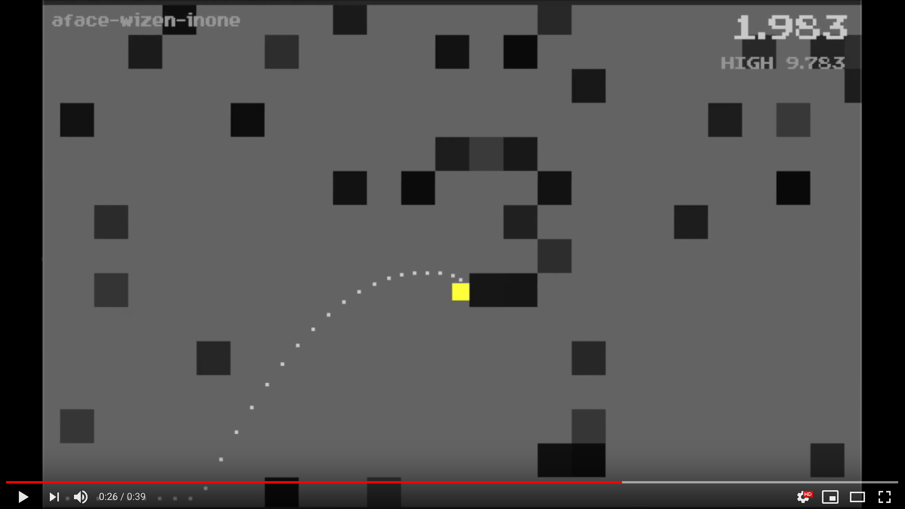

# Overview

A speedrun game. The goal is to reach the white box as fast as possible.

## Controls

- Keyboard left, right and up for movement. `N` for a new level, `R` to restart the current one, `F` to toggle fullscreen.
- Gamepad: left analog stick to move, `B` to jump,  `ZR` for a new level, `ZL` to restart the current one.

## Release 0.1 (release name: 'F*ck it, Ship it')

Features and remarks

- The core is **currently a mess**, but hey, it's released ¯\\_(ツ)_/¯
- Game runs :-)
- Self-implemented arcade physics
- Self-implemented dynamic viewport
- Gamepad (Nintendo Pro Controller on a Mac) and keyboard support
- Background music and game sound effects
- Random levels with rememberable level names to replay
- Highscores 
- Using [ebiten](https://ebiten.org/) and [resolv](https://github.com/SolarLune/resolv).

Thanks to [Patrick de Arteaga](https://patrickdearteaga.com/arcade-music) for the cool music!

## TODOs

- [ ] Extend this README
- [ ] [Allow `go get`](https://www.reddit.com/r/golang/comments/ess860/release_01_codename_fck_it_ship_it_of_my_speedrun/ffc9khm?utm_source=share&utm_medium=web2x)
- [ ] [Make dots fade out with time not just dissapear.]](https://www.reddit.com/r/golang/comments/ess860/release_01_codename_fck_it_ship_it_of_my_speedrun/ffc181e?utm_source=share&utm_medium=web2x)
- [ ] Cleanup code
- [ ] Restructure files
- [ ] Better gamepad support
- [ ] Menus, Splashscreen
- [ ] Ability to enter level codes
- [ ] Pack into single binary
- [ ] Release downloadable packages 

Based on [/u/jerf's](https://www.reddit.com/user/jerf/) [comment](https://www.reddit.com/r/golang/comments/ess860/release_01_codename_fck_it_ship_it_of_my_speedrun/ffcj3s1?utm_source=share&utm_medium=web2x)

> From a game perspective (rather than a Go perspective), the relatively quick arrival at top horizontal speed probably means the optimal run ends up looking like Super Mario Brothers 1 speed run, where the name of the game is just to stay at top horizontal speed while moving vertically around the obstacles as needed.
> 
> I'd suggest A: making the horizontal move more of an acceleration move, that asymptotically approaches a top speed (and not necessarily terribly quickly) and B: consider making jump take out some of the horizontal speed as well, perhaps even making the height of the jump partially dependent on horizontal speed. Another interesting thing I'd consider is making the "jump" button, when you are already in the air and very near a platform, reverse your horizontal momentum. I'd actually be inclined to play with not changing the vertical at all, though maybe a small boost might feel good. The idea is that maybe a skilled player might find a place in the level where the optimum move is to jump up and bounce off of two platforms to hit some hole at a higher speed than if they just came at it at the right, but slower, speed to jump through it directly.
> 
> That ought to give the physics a lot more character, and depth. Especially with horizontal speed determining jump height, there may well be a plodding, but safe, path through the level, but it would be slow. A more daring path might involve a lot more air time and higher horizontal speed, but with a greater chance of bonking. (Bonking time penalties proportional to the speed you bonk at might also help the risk/reward balance.)

- [ ] Improve physics 

## License

The source code is licensed under the [Apache license](https://raw.githubusercontent.com/mlesniak/speedrun/master/LICENSE)